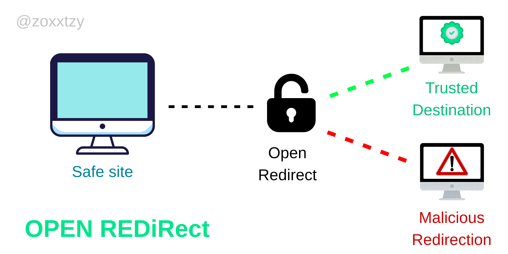

# Open Redirect Vulnerability



# Summary

> Open Redirect adalah sebuah kerentanan yang memanfaatkan pengalihan situs dari sebuah endpoint yang mengalihkan konten dari satu web ke web lainnya.
> Kerentanan ini biasa ditemukan pada endpoint yang membutuhkan pengalihan konten website seperti Registrasi, Login, dan lainnya.

# Affected Url
> https://redacted.target.com/login?referrer=
> https://redacted.target.com/register?referrer=

# Severity
> ⚠️ Medium
> CWE-601

# Steps to Reproduce
```bash
1. Buka halaman website yang terindikasi memiliki bug tersebut
2. Pada endpoint "?referrer=" tambahkan link external untuk mengujinya.
   Contoh: https://redacted.target.com/login?referrer=https://malicious.site/
3. Jika anda melakukannya pada endpoint "login" dan "register, segera isi form terlebih dahulu baru kemudian tekan enter.
4. Dan boom website dialihkan ke link external
```

# Proof of Concept
```bash
https://redacted.target.com/login?referrer=https://google.com/
```

# Impact
The primary impact of an open redirect vulnerability is enabling phishing, where attackers use a trusted domain to redirect users to malicious sites, making attacks seem legitimate and increasing credential theft.

# Mitigation and Remediation
To remediate open redirects, avoid user input in redirects, use a server-side whitelist of allowed domains/URLs, pass identifiers instead of full URLs, or, if unavoidable, force user confirmation on a warning page before redirection.

> Reporting Date: July 2024
> Status:         Resolved
> Bounty?         Coupon Code
